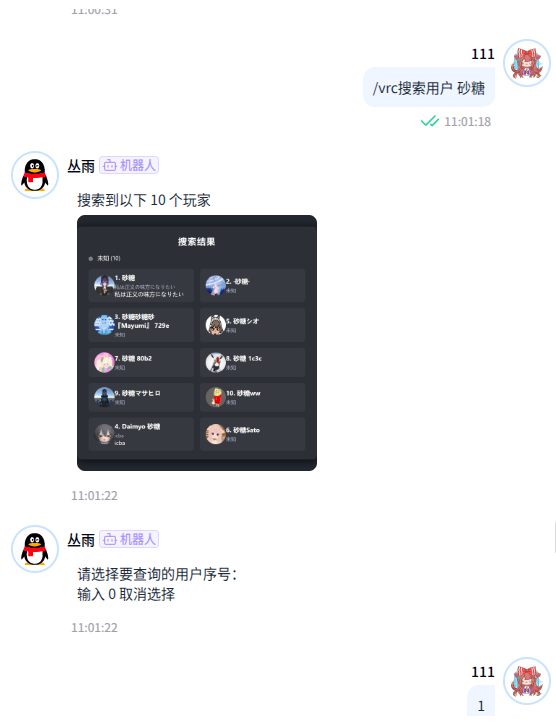

<!-- markdownlint-disable MD026 MD031 MD033 MD036 MD041 MD046 MD051 -->
<div align="center">
  
  <br>
  <p></p>
</div>

<div align="center">

# nonebot_plugin_vrchat

_✨ ~~来erp吗~~使用第三方 api 实现 vrchat 相关操作 ✨_

<a href="https://github.com/Agnes4m/nonebot_plugin_vrchat/stargazers">
        
</a>
<a href="https://github.com/Agnes4m/nonebot_plugin_vrchat/issues">
        
</a>
<a href="https://jq.qq.com/?_wv=1027&k=HdjoCcAe">
        
</a>
<a href="https://pypi.python.org/pypi/nonebot_plugin_vrchat">
        
</a>
    
    
</a>
</a>
    
    
</a>
<a href="https://github.com/nonebot/plugin-alconna">
        
</a>
</div>

## 说明


- 本插件国内服务器可使用
- 本插件支持alconna跨平台适配器使用
- 本插件支持alconna的i18n多语言适配
- 本插件图片生成使用浏览器渲染

## 使用

首先你应该私聊机器人发送`vrc登录`，按提示输入账号密码和验证码，才能正常使用功能

## 安装

## 💿 安装

以下提到的方法 任选**其一** 即可

<details open>
<summary>[推荐] 使用 nb-cli 安装</summary>
在 nonebot2 项目的根目录下打开命令行, 输入以下指令即可安装

```bash
nb plugin install nonebot-plugin-vrchat
```

</details>

<details>
<summary>使用包管理器安装</summary>
在 nonebot2 项目的插件目录下, 打开命令行, 根据你使用的包管理器, 输入相应的安装命令

<details>
<summary>pip</summary>

```bash
pip install nonebot-plugin-vrchat
```

</details>
<details>
<summary>pdm</summary>

```bash
pdm add nonebot-plugin-vrchat
```

</details>
<details>
<summary>poetry</summary>

```bash
poetry add nonebot-plugin-vrchat
```

</details>
<details>
<summary>conda</summary>

```bash
conda install nonebot-plugin-vrchat
```

</details>

打开 nonebot2 项目根目录下的 `pyproject.toml` 文件, 在 `[tool.nonebot]` 部分的 `plugins` 项里追加写入

```toml
[tool.nonebot]
plugins = [
    # ...
    "nonebot_plugin_vrchat"
]
```

</details>

## 指令

- `vrc帮助`： 获取指令帮助
- `vrc登录`： 登录（需要输入账号密码，建议私聊）

### 需要至少一个登录ck

- `vrc搜索用户【text】`：查询用户名称
  - `【index】`：返回查询列表的序号用户的具体信息
- `vrc搜索世界【text】`： 查询世界名称

### 需要自己登录ck
- `vrc全部好友`： 查询当前全部好友状态
- `vrc搜索用户【text】`：查询用户名称
  - `添加【index】`：添加对应序号的好友
- `vrc显示通知`：返回所有当前通知(未实现)


### 其他指令

- `lang switch zh-CN`： 切换语言为中文
- `lang switch en-US`： 切换语言为英文
- `lang switch ja-JP`： 切换语言为日语


## env.config配置

```base
# vrchat 配置
# default默认 tec科技风格(不好看)
vrchat_img = "default" 
# 是否显示头像, 关闭大幅度减小加载速度
vrchat_avatar = True

```


## 截图展示



## to do

- [ ] 搜索世界指令返回图片
- [ ] 返回个人通知信息
- [ ] 同意好友申请信息
- [ ] 上传头像信息
- [ ] 群组相关api(工作量超级大)
- [ ] 创建实例(可能是模拟进入世界？未知api效果)
- [ ] 邀请相关信息(游戏外邀请真的有用吗。)
- [ ] 玩家权限管理(显示权限吧，不太清楚)
- [ ] 用户模型查询和管理
- [ ] 好友管理(添加备注，获取注释或者组等等)
- [ ] 喜好的模型/好友/世界管理

## 感谢

- [vrchat 第三方 api](https://github.com/vrchatapi/vrchatapi-python)

## 其他

- 插件报错或建议：发iss或者 [q 群](https://qm.qq.com/q/qK3156ysN2) 或者邮箱
- [爱发电](https://afdian.tv/a/agnes_digital) 感谢大家的赞助！你们的赞助将是我继续创作的动力！

## 📝 更新日志

<details>
<summary>点击展开</summary>

### 0.1.2

- 修复了无法加载cookie的bug
- 新增i18n

### 0.1.1

- 新增了无法加载cookie的bug
- 修改了部分注释

### 0.1.0

- 修复人物图片错误
- 新增好友参数显示
- 新增查询好友图片

### 0.0.6

- 修复了图片错误
- 添加公共ck以供查询 by 饼干
- 修复查询用户因为部分参数为空导致被跳过的问题
- 重构了项目
- 新增查询好友用户距离上次时间

### 0.0.5

- 新增查询世界功能
- 新增人物图片 by 饼干佬
- 合并后不知道哪里出问题了）
- 暂时将适配器改成v11通过检查

### 0.0.4

- 新增查询用户功能
- 适配 nonebot2.1.\*
- 部分逻辑改进

### 0.0.3

- 通过 nonebot2 商店检查，删除 qqguild

### 0.0.2

- 使用 pre-commit 格式化项目

### 0.0.1

- 新建项目
- 增加“查询全部好友”功能
- 增加“查询在线好友功能”功能

</details>
