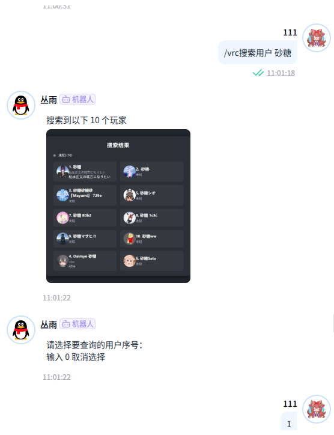
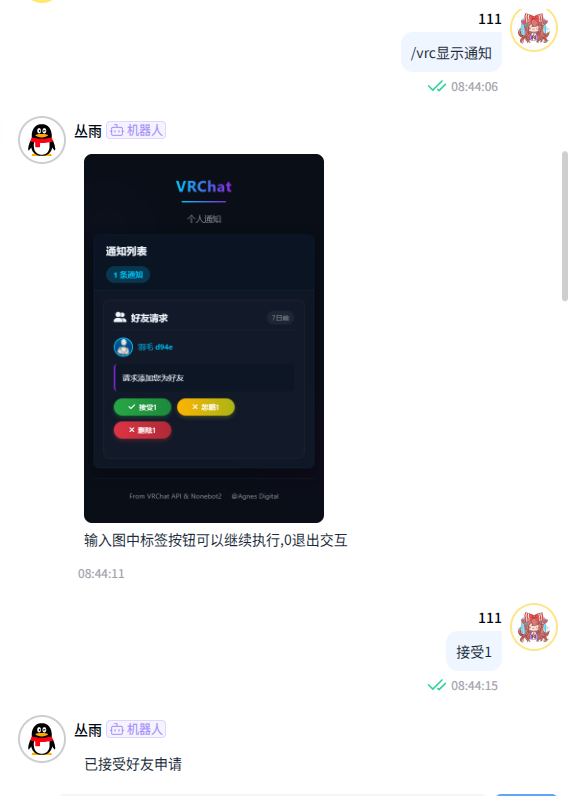

<div align="center">
  
  <br>
  <p></p>
</div>

<div align="center">

# nonebot_plugin_vrchat

_✨ 使用第三方 API 实现 VRChat 相关操作 ✨_

<a href="https://github.com/Agnes4m/nonebot_plugin_vrchat/stargazers">
  
</a>
<a href="https://github.com/Agnes4m/nonebot_plugin_vrchat/issues">
  
</a>
<a href="https://pypi.python.org/pypi/nonebot_plugin_vrchat">
  
</a>


</div>

## 说明

- 国内服务器可使用
- 支持 alconna 跨平台适配器
- 支持 alconna i18n 多语言（zh-CN / en-US / ja-JP）
- 图片生成使用浏览器渲染
- 当前项目功能已完善，以后仅做bug维护。之后会迁移更新这个项目[VrchatUID](https://github.com/Agnes4m/VrchatUID)

## 安装

### 推荐：nb-cli

```bash
nb plugin install nonebot-plugin-vrchat
```

### 包管理器

```bash
pip install nonebot-plugin-vrchat
# 或
uv add nonebot-plugin-vrchat
# 或
poetry add nonebot-plugin-vrchat
```

然后在 `pyproject.toml` 中启用：

```toml
[tool.nonebot]
plugins = ["nonebot_plugin_vrchat"]
```

## 使用

**首先私聊机器人发送 `vrc登录`，按提示输入账号密码和 2FA 验证码。**

## 指令

| 命令 | 说明 |
|------|------|
| `vrc帮助` | 查看所有指令 |
| `vrc登录` | 登录 VRChat 账户（建议私聊） |
| `vrc全部好友` | 查询全部好友状态（图片） |
| `vrc显示通知` | 查看通知列表 |
| `vrc搜索用户 <关键词>` | 搜索用户（图片） |
| `vrc搜索世界 <关键词>` | 搜索世界（图片） |
| `vrc收藏列表` | 查看收藏 |
| `vrc收藏组列表` | 查看收藏组 |
| `vrc群组帮助` | 群组相关指令 |
| `vrc经济帮助` | 经济相关指令 |

切换语言：

```text
lang switch zh-CN   # 中文
lang switch en-US   # 英文
lang switch ja-JP   # 日文
```

## 配置（全部可选）

```dotenv
# 好友列表/个人卡片图片模板
vrchat_img="default"

# 是否下载并显示用户头像（关闭可大幅提升出图速度）
vrchat_avatar=true

# 2FA 验证码等待超时（timedelta 格式，PT5M = 5 分钟）
session_expire_timeout=PT5M
```

## 常见问题

**`playwright._impl._errors.Error: Page.wait_for_timeout: expected float, got undefined`**

注释掉 `nonebot_plugin_htmlrender\data_source.py` 中的 `await page.wait_for_timeout(wait)` 即可临时解决。

## 截图




## 反馈

- [GitHub Issues](https://github.com/Agnes4m/nonebot_plugin_vrchat/issues)
- [爱发电](https://afdian.tv/a/agnes_digital)

## 致谢

- [vrchatapi-python](https://github.com/vrchatapi/vrchatapi-python)

## 更新日志

### 0.3.5

- 修复累计的 bug
- 优化代码结构
- 修复了请求和图片缓存的一些问题
- 使用httpx全面替代aiohttp

### 0.3.4

- 修复累计的 bug
- 更新 `vrchatapi-python` 至 1.20.7
- 新增 `vrc群组帮助` / `vrc经济帮助`
- 优化代码结构

### 0.1.2

- 修复无法加载 cookie 的 bug
- 新增 i18n

### 0.1.0

- 修复人物图片错误
- 新增好友参数显示
- 新增查询好友图片
